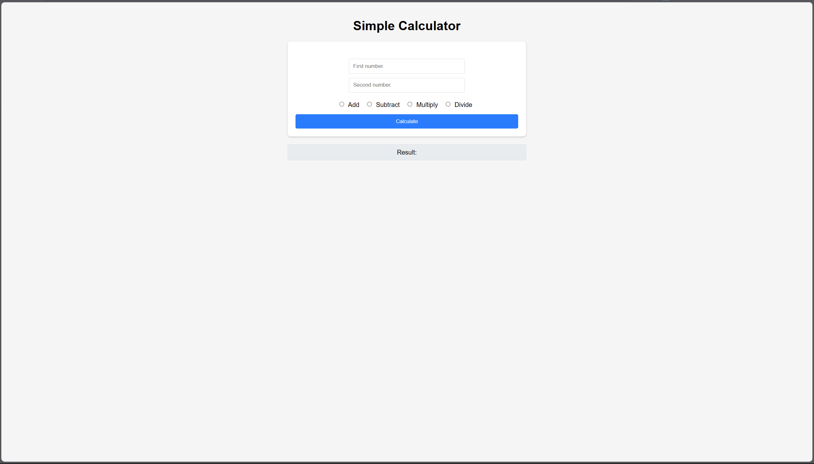

# Flask_Calc
A simple calculator made using Python and the Flask framework.


## Table of Contents?
- [Installation](#Installation)
- [Usage](#Usage)
- [Demonstration](#Demonstration)

## Prerequisites
- Python, 3.12.2.
- Windows, Linux, or MacOS.

## Installation
1. Clone the repository:

```
git clone https://github.com/Aser-Osama/FlaskCalc.git
```
2. Go to directory:
```
cd FlaskCalc
```
3. Install the dependencies:
```
pip install -r requirements.txt
```

## Usage
Starting the application:
```
flask --app app run 
```

## Demonstration
Video Demonstration:
[Video Link](https://youtu.be/-JERhsHXrrc)
